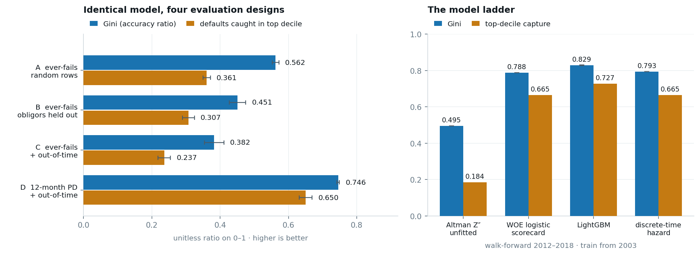
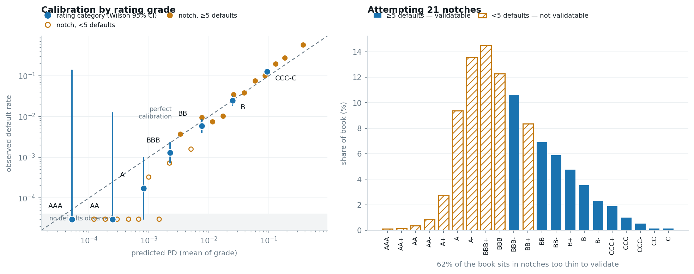

# Corporate Credit Early-Warning System

A point-in-time probability-of-default model for US listed corporates, built to answer the
question a credit committee actually asks — *which names in this book deteriorate over the next
twelve months?* — rather than the question the public benchmark accidentally poses.

**78,682 firm-years · 8,971 companies · 609 defaults · 1999–2018**



---

## Why this repo exists

The [American Bankruptcy panel](https://github.com/sowide/bankruptcy_dataset) is one of the most
heavily worked corporate-default datasets in public circulation, and reported accuracies on it sit
between 93% and 100%. Auditing it before modelling turned up three defects, each of which changes
what a model trained on it actually learns.

### 1. The target is a company attribute, not an event

Zero of 8,971 companies change label across their panel history. A firm that filed Chapter 11 in
2016 is marked `failed` in 1999 too — 609 failed companies generate 5,220 positive rows, an average
of 8.6 each. Any random row split therefore puts the same obligor on both sides of the test, and the
modelled question silently becomes *"does this firm eventually die within two decades"*.

### 2. The published variable dictionary is wrong, and magnitudes are corrupted

The variable mapping was recovered by matching value multisets against the authors' own named
supplementary files. It is a clean bijection and it disagrees with the published dictionary: what is
documented as *retained earnings* is total current liabilities; what is documented as *market value*
is total liabilities. Under the published names, retained earnings is never negative across 78,682
observations — which cannot happen.

The corrected mapping then exposes a second defect. Only 52.6% of rows satisfy
`EBITDA − D&A = EBIT`, but **100%** satisfy it once individual cells are rescaled by powers of
1,000. The underlying accounting is internally consistent; the file is not.

`total_opex` also excludes depreciation and amortisation — `Revenue − OpEx` reconciles to **EBITDA**
(0.74 of rows), not EBIT (0.04). Reading it as a full operating-expense line, which is the natural
reading of the name, is a separate error from the corruption.

### 3. Default capture is incomplete before 2003

Over 1999–2002 only 37 exits are labelled as defaults while 1,633 companies leave the panel, 52% of
them with a negative Altman Z″. The 37 labelled defaults of that era are also far less distressed
(median Z″ −0.75, median ROA −0.001) than defaults from 2007 onward (median Z″ −6.8, median ROA
−0.35) — the signature of a label set that caught only the most unambiguous cases. Training across
that boundary teaches the model that deeply distressed firms survive.

**Confirmed against an external register.** US Courts business Chapter 11 filing statistics are a
complete administrative count. Ranking every year in both series, with no proportionality assumed:

| Filing year | National Ch11 rank | Panel hazard rank | Panel hazard |
|---|---|---|---|
| 2001 | 3rd of 19 | **19th — last** | 0.13% |
| 2002 | 4th | **18th** | 0.20% |
| 2003 | 9th | 17th | 0.37% |
| 2004 | 6th | 15th | 0.66% |
| 2009 | 1st | 1st | 1.50% |
| *median year* | — | — | 0.91% |

2001 and 2002 were the third and fourth heaviest national filing years of the period. They are the
two *lowest* default-rate years in the panel. That contradiction needs no modelling assumption to
read. Scaling the panel's later capture rate back onto the national series implies roughly 190
defaults over 2001–2003 against 34 observed — but that calculation assumes a proportionality that
is itself weak over 2004–2018 (Spearman ρ = −0.07), so treat it as an order of magnitude, not a
count. The rank comparison is the load-bearing evidence.

One honest complication: filing year 2010 shows the same signature (2nd nationally, 16th in the
panel) inside the supposedly reliable period. The plausible reading is population mix — listed-
company defaults front-ran in 2008–09, where the panel ranks 2nd and 1st, while the 2010 national
surge was driven by small private filers. It is not explained away, and it is why the cut year was
settled empirically rather than by inspection.

**Why the cut is fiscal 2003 and not 2004.** The register says capture is still depressed in fiscal
2003 (filing year 2004). But excluding it costs more training volume than it recovers in label
quality — fiscal 2003 beats 1999, 2004, 2005 and 2006 as a start year in 5 of 5 paired seed runs.
The optimal cut is not the clean-label boundary; it is where the bias-variance trade-off lands.

---

## What fixing all three is worth

Identical model, identical features, four evaluation designs, test window 2015–2018.
Mean ± sd over 5 seeds:

| Arm | Target | Split | Gini | Top-decile capture | Accuracy |
|---|---|---|---|---|---|
| A | ever-fails | random rows *(the published setup)* | 0.562 ± 0.010 | 0.361 ± 0.011 | 93.6% |
| B | ever-fails | obligors held out | 0.451 ± 0.024 | 0.307 ± 0.018 | 93.1% |
| C | ever-fails | held out + out-of-time | 0.382 ± 0.029 | 0.237 ± 0.018 | 97.9% |
| **D** | **12-month PD** | **held out + out-of-time** | **0.746 ± 0.004** | **0.650 ± 0.018** | 99.0% |

Holding obligors out costs 11 Gini points; also moving out of time costs another 7. Together, **32%
of the reported skill in arm A is an artefact of the evaluation design.** Re-posing the target as a
genuine twelve-month default then nearly doubles it back, because *deteriorating now* is a far
cleaner signal than *dies eventually*.

Accuracy *rises* as the model gets worse, because the base rate falls. It is not reported anywhere
else in this repo.

Walk-forward — expanding-window train, one test year per fold, 2012–2018, 206 defaults, 5 seeds:

| Train from | Gini | Top-decile capture |
|---|---|---|
| 1999 (all) | 0.820 ± 0.005 | 0.703 ± 0.013 |
| **2003 (reliable labels)** | **0.829 ± 0.003** | **0.727 ± 0.008** |
| 2006 | 0.813 ± 0.005 | 0.717 ± 0.010 |

Training from 2003 beats training from 1999 by +0.008 Gini and +2.0 points of capture — positive in
8 of 10 paired runs — while *discarding a third of the training rows*. Training from 2006 is no
better than 1999. That shape, rather than any single delta, is what supports the label-capture
story: there is something wrong with the early years specifically, not a general preference for
recent data.

---

## The model ladder

Each rung has to beat the one below it. Walk-forward 2012–2018, train from 2003, 206 defaults:

| | Gini | Top-decile capture | PR-AUC | Brier |
|---|---|---|---|---|
| 1 Altman Z″, unfitted | 0.495 | 0.184 | 0.021 | — |
| 2 WOE logistic scorecard | 0.788 | 0.665 | 0.106 | 0.124 |
| **3 LightGBM** | **0.829 ± 0.003** | **0.727** | **0.208** | 0.009 |
| 4 Discrete-time hazard (cloglog + tenure baseline) | 0.793 | 0.665 | 0.123 | 0.009 |

Three things worth reading off this table.

**The 1968 formula gets half the Gini for zero parameters — but only 18% of the tail.** Altman Z″
ranks the population respectably and is nearly useless where a watchlist actually operates. Gini
alone would have hidden that; capture-at-decile is the metric that exposes it.

**Boosting is worth +0.041 Gini and +6.2 points of capture over the scorecard.** Real, but that is
the whole case for it. A bank weighing that against the model-risk overhead of a non-parametric
model is making a defensible decision either way, and the scorecard is what would actually clear
validation.

**The survival framing buys almost nothing here — +0.005 Gini over the same inputs.** Once
eligibility already handles censoring and the horizon is one year, a discrete-time hazard reduces to
a binary classifier with a tenure covariate. Recorded as a negative result rather than dropped.

The Brier column is not yet a calibration result. The scorecard's 0.124 against LightGBM's 0.009 is
almost entirely `class_weight='balanced'`, which inflates predicted probabilities by roughly the
inverse base rate. It costs nothing in ranking and destroys the probabilities. Fixing that is W5.

### The bug this rung caught

`altman_z` is *by construction* `6.56·wc_ta + 3.26·re_ta + 6.72·ebit_ta + 1.05·mve_tl` — an exact
linear dependency inside the feature library. Gradient boosting is indifferent to it. Maximum
likelihood is not: the first hazard fit returned a Gini of **0.06**, near chance, from a singular
design matrix. A column-pivoted QR now selects a maximal independent subset before fitting, and a
test asserts the dependency still exists so the guard cannot be removed by accident.

A second, subtler version: on raw standardised ratios the same rung scored 0.551, and the gap was
the skew of the untransformed inputs rather than anything about hazard models. It is fitted on
WOE-transformed inputs so that rung 4 differs from rung 2 *only* in the survival framing.

---

## Calibration and the rating scale

A score that ranks is not a PD. Isotonic regression fitted **inside each fold** on cross-validated
training predictions — calibrating on the model's own in-sample scores is the usual way this goes
wrong, and it looks excellent right up until it is evaluated out of time.



Across 22,755 obligor-years and 206 defaults: **mean predicted PD 0.875% against an observed default
rate of 0.905%** — 3% out at portfolio level. The Murphy decomposition puts the reliability
(miscalibration) term at 0.000025 of a Brier score of 0.008018 — 0.3%. Almost all remaining Brier is
irreducible uncertainty, which is what a 0.9% base rate looks like.

### 21 notches, attempted

The scale is an **internal master scale wearing agency-style labels** — 21 grades, geometric PD
bands at a ratio of 1.5 per notch. It is not a claim that this model's BBB is S&P's BBB; the bands
come from the scale design, not from anyone's published default study. That distinction survives
being asked about; the alternative does not.

Attempted at notch level, the answer is that the data does not support it:

- **10 of 21 notches carry fewer than 5 defaults**, and those notches hold **62% of the book**. The
  entire investment-grade half of the scale is statistically empty.
- Notch-level observed default rates are **not monotone** — BBB+ sits below A−, BB+ below BBB−, BB−
  below BB. Those inversions are sampling noise, but a rating scale that inverts is not a scale.

Rolled up to rating categories, it holds:

| | Obligor-years | Defaults | Predicted PD | Observed | Wilson 95% CI |
|---|---|---|---|---|---|
| AAA | 24 | 0 | 0.005% | 0.000% | [0.00, 13.80] |
| AA | 309 | 0 | 0.025% | 0.000% | [0.00, 1.23] |
| A | 5,842 | 1 | 0.082% | 0.017% | [0.00, 0.10] |
| BBB | 8,516 | 11 | 0.224% | 0.129% | [0.07, 0.23] |
| BB | 4,813 | 28 | 0.763% | 0.582% | [0.40, 0.84] |
| B | 2,412 | 59 | 2.480% | 2.446% | [1.90, 3.14] |
| **CCC-C** | 839 | 107 | **9.378%** | **12.753%** | **[10.67, 15.18]** |

Monotone in observed default rate, and six of seven categories contain their own predicted PD inside
the observed interval.

**The seventh is the one that matters.** CCC-C predicts 9.4% and defaults at 12.8%, with the
interval excluding the prediction. The model under-states risk in the worst grade — the one a
watchlist is built out of, and the one feeding any expected-loss number. Being conservative in the
other direction would be unremarkable; this is a finding, and fixing it (a tail-weighted calibrator,
or a separate calibration segment below B−) is the first item of unfinished work.

### One-year migration, by category (row-normalised, %)

| from ↓ to → | AAA | AA | A | BBB | BB | B | CCC-C |
|---|---|---|---|---|---|---|---|
| AAA | 14.3 | 38.1 | 47.6 | 0.0 | 0.0 | 0.0 | 0.0 |
| AA | 3.6 | 33.1 | 60.5 | 2.0 | 0.0 | 0.8 | 0.0 |
| A | 0.2 | 4.2 | 65.4 | 26.4 | 3.2 | 0.5 | 0.1 |
| BBB | 0.0 | 0.1 | 20.6 | 54.5 | 19.5 | 4.5 | 0.7 |
| BB | 0.0 | 0.0 | 3.2 | 31.2 | 42.4 | 19.2 | 4.0 |
| B | 0.0 | 0.0 | 0.7 | 11.6 | 30.4 | 41.3 | 16.0 |
| CCC-C | 0.0 | 0.0 | 0.2 | 5.5 | 15.8 | 36.4 | 42.1 |

Diagonal-dominant with decay away from it, and stickiest at the ends — the shape an agency
transition matrix has. The AAA row rests on 21 observations and should not be read.

---

## Honest limitations

- **The repair's integrity case is closed; its performance case is not.** Identities go from 0.56 to
  1.00 and 1,000× jumps from 29.3% to 0.02%, but the effect on discrimination is +0.065 Gini for
  unfitted Altman Z″ (95% CI [−0.011, +0.136]) and +0.036 for the full model ([−0.020, +0.091]).
  Both positive in ~92% of obligor-clustered bootstrap resamples; neither decisive.
- **The 2003 cut is a judgement call.** +0.008 Gini is small. What carries it is the shape across
  three training windows plus the descriptive evidence on exits, not the delta on its own.
- **Exits are pooled as one censoring event.** The data cannot distinguish acquisition from
  delisting from loss of coverage. If exit correlates with credit quality, the hazard is biased.
  Treating exits as survivals — the alternative — is strictly worse.
- **CCC-C is miscalibrated.** 9.4% predicted against 12.8% observed, interval excluding the
  prediction. Under-stating risk in the worst grade is the wrong direction to be wrong in.
- **The notch scale is presented as a negative result.** 10 of 21 notches hold fewer than 5
  defaults. Use the categories.
- **The external register is a different population.** US Courts counts every business Chapter 11
  filer, private companies included. The rank comparison survives that; the implied-shortfall
  estimate does not, and is labelled accordingly.
- **Reason codes are not built yet.** SHAP attributions mapped to analyst-readable text is the
  remaining half of W5.

### A note on seeds

An earlier revision of this repo reported two conclusions that turned out to be single-seed noise:
that a larger feature library hurt, and that the 2003 cut gained +0.011 Gini. Re-running across five
seeds reversed the first (the extended library is marginally *better*, +0.008) and halved the
second. Fold-level Gini on ~30 defaults carries a seed standard deviation of 0.004–0.008, which is
the same size as the effects being measured. `evaluate.py` therefore averages over five seeds by
default, and every number above is a mean with its spread. Single-seed comparisons of this kind are
not evidence, and the discipline is cheap.

---

## Reproduce

```bash
pip install -r requirements.txt
make all
```

`make all` clones the source panel, runs the audit, repairs the scale corruption, builds
point-in-time labels, runs the walk-forward evaluation, fits the model ladder and calibrates the
rating scale. Roughly 35 minutes on a laptop.

Individual stages:

```bash
make data       # clone the source panel
make audit      # variable-mapping recovery + corruption quantification
make repair     # -> outputs/clean_panel.parquet
make labels     # -> outputs/labelled_panel.parquet
make evaluate   # walk-forward results
make ladder     # the four-rung model comparison
make calibrate  # calibrated PDs, master scale, migration matrix
make register   # external validation of the label-capture finding
make test       # pytest
```

## Layout

```
src/
  audit.py           variable-mapping recovery, corruption quantification
  repair.py          DP over within-firm continuity + chained identity solving
  labels.py          point-in-time labels, censoring, exit taxonomy, folds
  features.py        credit ratio library: levels, trajectories, industry-relative
  leakage.py         the four-arm evaluation-design experiment
  evaluate.py        walk-forward protocol and the label-capture test
  ladder.py          the four-rung model comparison, WOE scorecard included
  calibrate.py       isotonic calibration, 21-notch master scale, migration matrix
  external_register.py  Finding 04 against US Courts Chapter 11 filing statistics
  verify_repair.py   does the repair change anything that matters?
tests/               invariants the repair and labels must satisfy
docs/findings.md     the audit written up in full
```

## Data

Not vendored. `make data` clones
[sowide/bankruptcy_dataset](https://github.com/sowide/bankruptcy_dataset) into `data/`.

## Citation

Pellegrino, M., Lombardo, G., Adosoglou, G., Cagnoni, S., Pardalos, P. M., & Poggi, A. (2022).
*Machine Learning for Bankruptcy Prediction in the American Stock Market: Dataset and Benchmarks.*
Future Internet, 14(8), 244.

Nothing here is a criticism of that paper's method — it uses obligor-disjoint splits and an
out-of-time test set. The defects documented above concern the distributed data file and the
downstream notebook ecosystem built on it.

## Licence

MIT.
